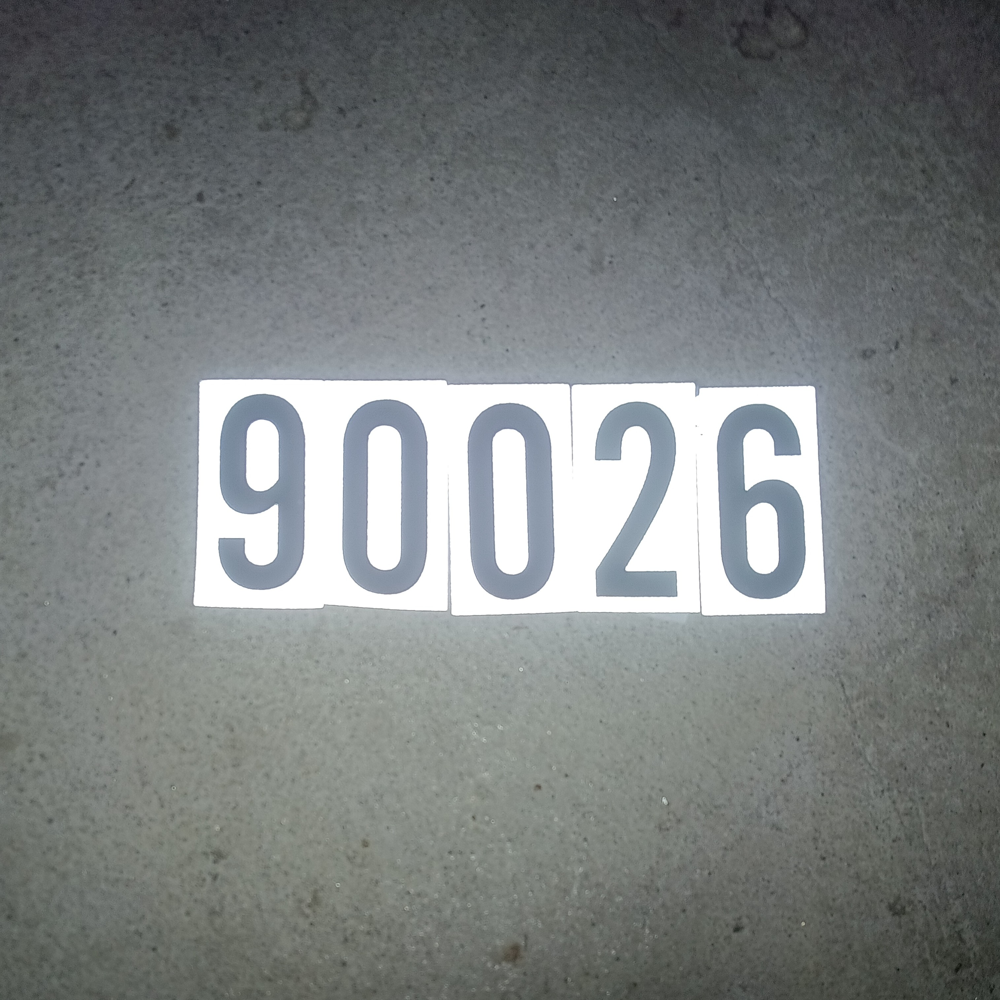
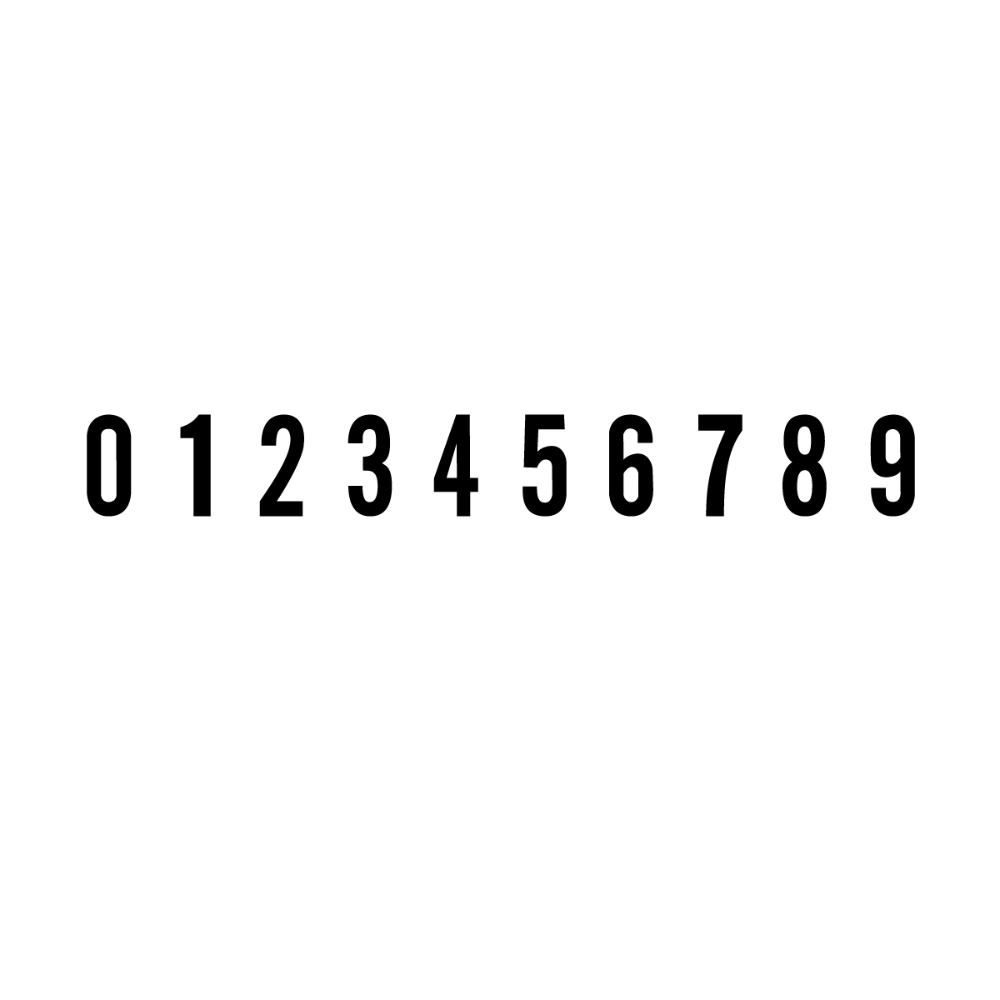
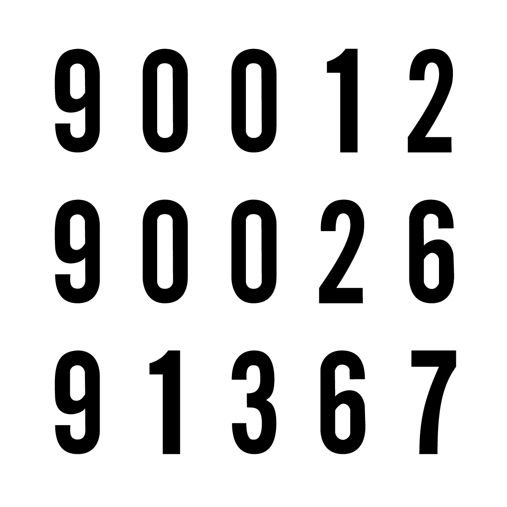
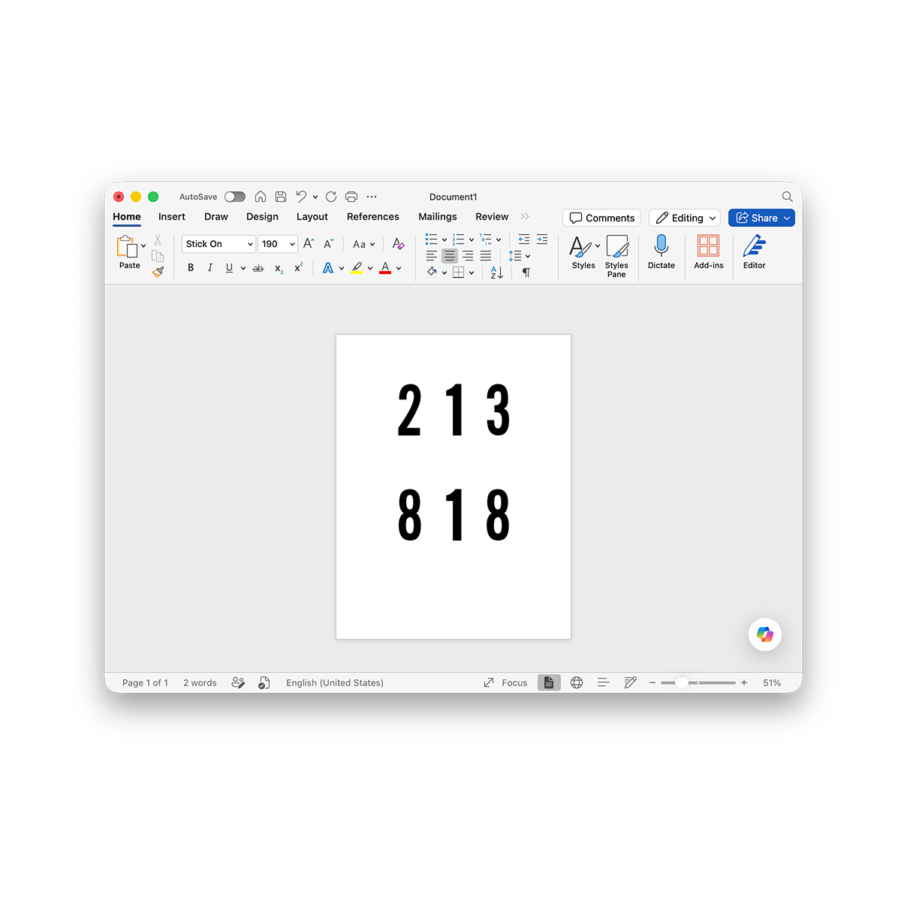

# Stick On



The stick-on numbers from the hardware store. The little vinyl digits off the rack. The ones you grab for labeling a mailbox or slaps.

Turned them into a typeface, 0–9. Monospaced, one slot per digit. Skinny `1`, fat `8`, same box.

You don't overlap stickers when you line them up. So I didn't let the font either.





## Get the font

Grab a release from the [Releases](../../releases) page, or pull the files straight from [`fonts/`](fonts):

- **`fonts/desktop/`** — `.otf` and `.ttf` for installing on your computer.
- **`fonts/web/`** — `.woff2` and `.woff` for the web.

## Using it on the web

Self-host the web files and point `@font-face` at them:

```css
@font-face {
  font-family: "Stick On";
  src: url("StickOn-Regular.woff2") format("woff2"),
       url("StickOn-Regular.woff") format("woff");
  font-weight: 400;
  font-style: normal;
  font-display: swap;
}

.number {
  font-family: "Stick On", monospace;
}
```

It only draws `0`–`9`. Set it on something that's just digits.

## Using it in Microsoft Office

Install `fonts/desktop/StickOn-Regular.otf` (or the `.ttf`), restart the app, and pick **Stick On** from the font menu. Type numbers.



## License

SIL Open Font License 1.1 — see [`OFL.txt`](OFL.txt). Free to use, study, modify, and share; just don't sell it on its own.

Copyright 2026 Michael Seh, with Reserved Font Name "Stick On".

[michaelsfonts.com](https://michaelsfonts.com)
